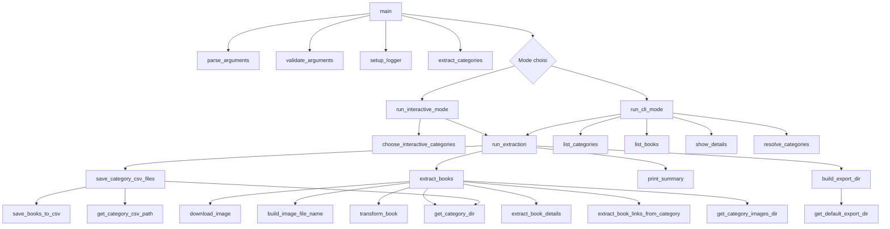
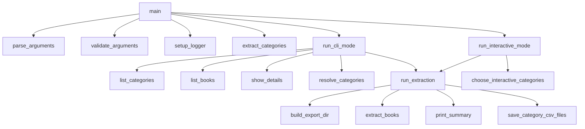
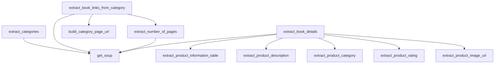
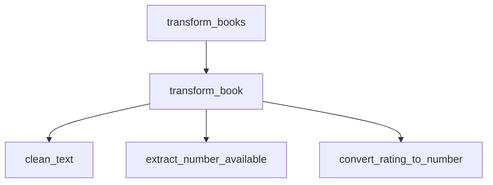
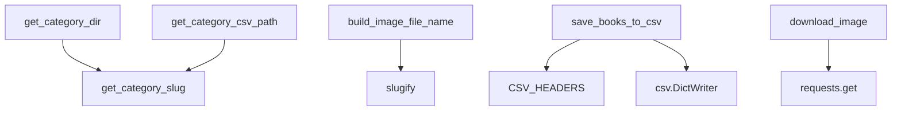
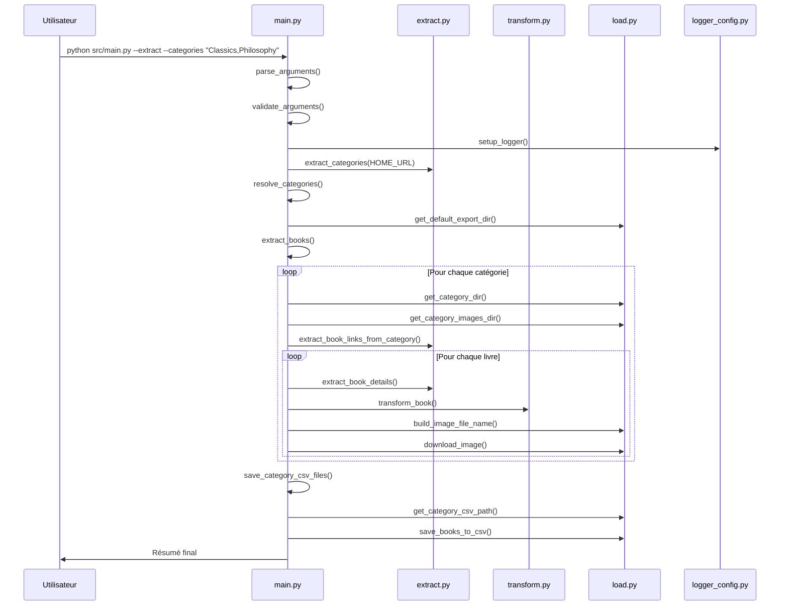

# Cartographie des appels de fonctions — OC-PY02

**Projet :** OC-PY02 — Analyse de marché avec Python  
**Auteur :** Fabien Hummel  
**Objectif :** visualiser quelles fonctions appellent quelles autres fonctions.

---

## 1. Vue globale

---

## 2. Appels depuis `main.py`

### Lecture du schéma

- `main()` initialise le programme.
- `run_cli_mode()` choisit l'action selon les options de ligne de commande.
- `run_extraction()` lance le vrai traitement d'extraction et de sauvegarde.

---

## 3. Appels dans la partie Extract

### Lecture du schéma

- `get_soup()` est la fonction de base pour récupérer et analyser une page HTML.
- `extract_book_links_from_category()` parcourt les pages d'une catégorie.
- `extract_book_details()` rassemble les informations détaillées d'un livre.

---

## 4. Appels dans la partie Transform

### Lecture du schéma

- `transform_book()` est la fonction principale du module `transform.py`.
- Elle s'appuie sur des fonctions spécialisées pour nettoyer et convertir les données.

---

## 5. Appels dans la partie Load

### Lecture du schéma

- Les fonctions de chemin créent l'organisation des dossiers.
- `save_books_to_csv()` écrit les fichiers CSV.
- `download_image()` télécharge les images dans les dossiers de catégorie.

---

## 6. Chaîne complète d'une extraction

---

## 7. Points clés à retenir

- `main.py` orchestre les appels.
- `extract.py` récupère les données depuis le web.
- `transform.py` prépare les données pour le CSV.
- `load.py` écrit les CSV et télécharge les images.
- `logger_config.py` prépare les logs.
- La logique principale se lit de haut en bas : arguments, catégories, livres, détails, transformation, sauvegarde.
