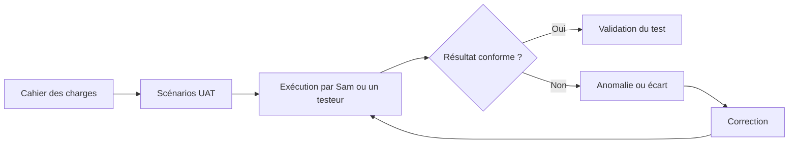
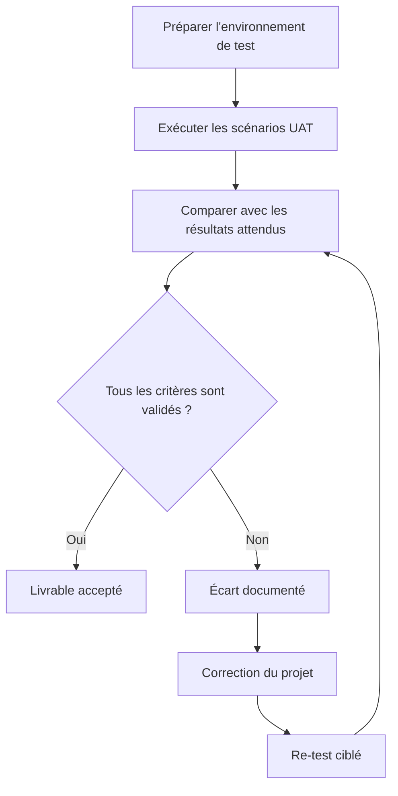
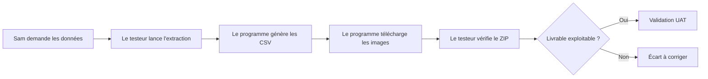

# Manuel UAT — Tests d'acceptation utilisateur

**Projet :** OC-PY02 — Analyse de marché avec Python  
**Auteur :** Fabien Hummel  
**Document :** Manuel de démarche UAT

---

## 1. Objectif du manuel

Ce document explique la démarche **UAT** à appliquer au projet OC-PY02.

UAT signifie **User Acceptance Test**, ou **test d'acceptation utilisateur**. L'objectif est de vérifier que l'application répond bien au besoin exprimé par le demandeur, dans un contexte proche de son utilisation réelle.

Dans ce projet, les UAT doivent permettre à Sam, ou à un utilisateur testeur, de vérifier que l'application permet bien de :

- exécuter le code depuis le repository GitHub ;
- générer les données attendues ;
- produire les fichiers CSV demandés ;
- télécharger les images associées ;
- organiser les livrables de manière exploitable ;
- comprendre le rôle du pipeline ETL.

---

## 2. Différence entre tests techniques et UAT

Les tests techniques vérifient que le code fonctionne correctement d'un point de vue développeur.

Les UAT vérifient plutôt que la solution répond au besoin utilisateur et au cahier des charges.

| Type de test | Question principale | Exemple dans le projet |
|---|---|---|
| Test technique | Est-ce que le code fonctionne correctement ? | Vérifier que `--detail` accepte plusieurs titres. |
| Test UAT | Est-ce que le livrable répond au besoin de Sam ? | Vérifier que les données demandées sont bien générées et exploitables. |

Un test UAT ne cherche donc pas à tester toutes les options internes du programme. Il se concentre sur les scénarios utiles pour valider le besoin métier.

---

## 3. Principe général de la démarche UAT

Le processus est volontairement simple :

1. partir du cahier des charges ;
2. définir les scénarios à tester ;
3. exécuter les tests ;
4. noter les résultats ;
5. corriger les écarts si nécessaire ;
6. rejouer les tests concernés.

---

## 4. Acteurs du processus UAT

| Rôle | Responsabilité |
|---|---|
| Demandeur / responsable d'équipe | Valide que le livrable répond au besoin attendu. |
| Utilisateur testeur | Exécute les scénarios UAT et note les résultats obtenus. |
| Développeur | Corrige les écarts constatés et fournit une version mise à jour. |
| Évaluateur | Peut vérifier la cohérence entre le cahier des charges, le code et les livrables. |

Dans ce projet, Sam représente le demandeur métier. Le testeur peut être Sam ou une personne chargée de vérifier les livrables avant validation.

---

## 5. Périmètre des UAT du projet OC-PY02

Les UAT doivent couvrir uniquement les exigences demandées dans le projet.

### Inclus dans les UAT

- installation du projet depuis GitHub ;
- présence du `README.md` et du `requirements.txt` ;
- absence des données générées dans le repository ;
- génération des données demandées ;
- présence des champs imposés dans le CSV ;
- téléchargement des images ;
- organisation du ZIP final ;
- explication du pipeline ETL dans un mail PDF.

### Hors périmètre UAT

Les éléments suivants peuvent être testés dans le protocole technique, mais ne sont pas indispensables pour l'acceptation utilisateur :

- option `--list categories` ;
- option `--list books` ;
- option `--detail` ;
- mode interactif ;
- mode silencieux `--quiet` ;
- détail interne des fonctions Python.

---

## 6. Cahier des charges couvert par les UAT

Le cahier des charges demande notamment :

| Exigence | Vérification UAT associée |
|---|---|
| Fournir un repository GitHub public | Vérifier que le lien GitHub est accessible. |
| Inclure un `requirements.txt` | Vérifier que les dépendances peuvent être installées. |
| Inclure un `README.md` complet | Vérifier qu'un utilisateur peut exécuter le projet avec les instructions. |
| Ne pas inclure les données et images dans GitHub | Vérifier que les fichiers générés ne sont pas versionnés. |
| Générer les données extraites | Vérifier que le CSV est produit après exécution. |
| Extraire les champs demandés | Vérifier les colonnes du CSV. |
| Télécharger les images | Vérifier que les images sont présentes dans le dossier généré. |
| Fournir un ZIP des données générées | Vérifier l'organisation du ZIP final. |
| Expliquer le pipeline ETL | Vérifier le mail PDF destiné à Sam. |

---

## 7. Cycle de validation UAT

Le re-test ne concerne que les points corrigés. Il n'est pas nécessaire de rejouer tous les tests si l'écart est limité à une fonctionnalité précise.

---

## 8. Statuts possibles d'un test UAT

| Statut | Signification |
|---|---|
| Réussi | Le résultat obtenu correspond au résultat attendu. |
| Échec | Le résultat obtenu ne respecte pas le critère d'acceptation. |
| Non testé | Le test n'a pas encore été exécuté. |
| Bloqué | Le test ne peut pas être réalisé à cause d'un prérequis manquant. |
| À corriger | Une anomalie ou un écart est identifié et doit être traité. |

---

## 9. Gestion des anomalies

Une anomalie UAT doit être décrite simplement, sans entrer inutilement dans le détail technique.

| Élément à documenter | Exemple |
|---|---|
| ID du test | UAT-08 |
| Résultat attendu | Un CSV distinct doit être généré pour chaque catégorie. |
| Résultat obtenu | Un seul CSV global est généré pour plusieurs catégories. |
| Impact | Écart avec le cahier des charges. |
| Décision | Correction à planifier. |

---

## 10. Exemple appliqué au projet

Dans ce projet, un test UAT ne cherche pas à vérifier chaque ligne de code. Il vérifie que le résultat obtenu est exploitable par Sam.

---

## 11. Décision finale d'acceptation

À la fin des tests UAT, trois décisions sont possibles :

| Décision | Signification |
|---|---|
| Accepté | Tous les critères principaux sont validés. |
| Accepté avec réserve | Le livrable est utilisable, mais certains points mineurs doivent être corrigés. |
| Refusé | Un ou plusieurs écarts bloquants empêchent l'acceptation du livrable. |

Pour le projet OC-PY02, un point peut nécessiter une attention particulière : la génération d'un **CSV distinct par catégorie**, si l'exigence est appliquée strictement.

---

## 12. Bonnes pratiques pour exécuter les UAT

- Tester depuis un environnement propre.
- Suivre les étapes dans l'ordre.
- Ne pas modifier le code pendant l'exécution des tests.
- Capturer les preuves importantes avec des captures d'écran.
- Noter clairement les écarts observés.
- Corriger les écarts, puis rejouer les tests concernés.
- Conserver le document de résultats UAT avec les livrables.

---

## 13. Documents associés

| Document | Rôle |
|---|---|
| `README.md` | Instructions d'installation et d'utilisation. |
| `requirements.txt` | Dépendances Python nécessaires. |
| `tests/protocole_de_tests.md` | Tests techniques du script. |
| `tests/uat_resultats_tests_acceptation.md` | Résultats des tests UAT à compléter. |
| Mail PDF ETL | Explication métier du pipeline Extract, Transform, Load. |

---

## 14. Sources d'inspiration

Ce manuel s'inspire de bonnes pratiques générales sur les tests d'acceptation utilisateur :

- CustUp — UAT, définition, enjeux et conseils ;
- Kapptivate — Comprendre les tests UAT.

Les principes retenus sont :

- tester la solution du point de vue de l'utilisateur final ;
- partir des cas d'utilisation réels ;
- définir des critères d'acceptation ;
- documenter les résultats ;
- corriger les écarts puis rejouer les tests concernés.
