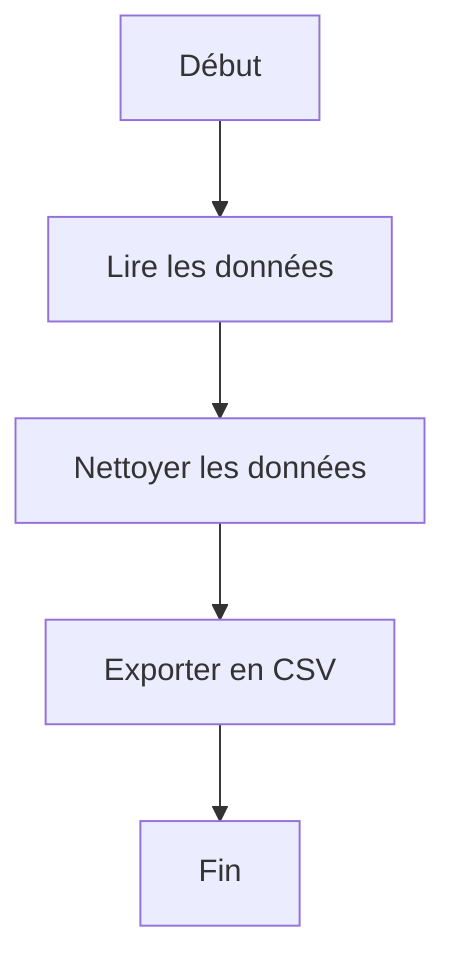
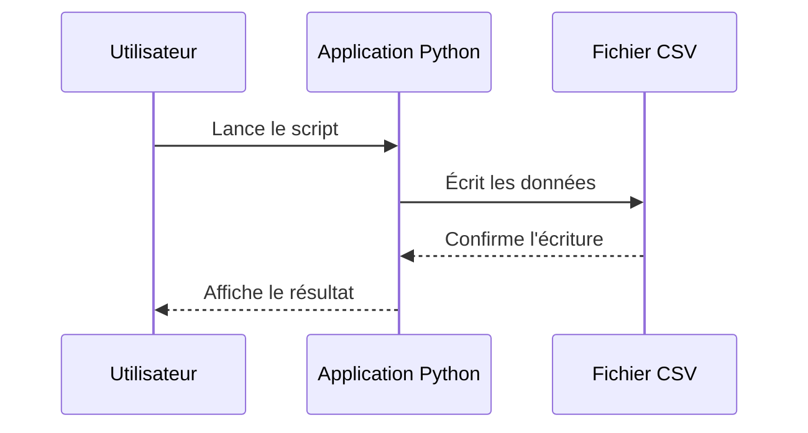

# Markdown Cheat Sheet

> Référence pratique pour écrire de la documentation claire dans un dépôt GitHub.
>
> Objectif : pouvoir copier-coller rapidement des syntaxes Markdown, HTML ou exemples compatibles avec GitHub.

---

## Sommaire

- [1. Principes de base](#1-principes-de-base)
- [2. Titres](#2-titres)
- [3. Paragraphes et retours à la ligne](#3-paragraphes-et-retours-à-la-ligne)
- [4. Texte en gras, italique, barré](#4-texte-en-gras-italique-barré)
- [5. Citations](#5-citations)
- [6. Listes](#6-listes)
- [7. Cases à cocher](#7-cases-à-cocher)
- [8. Code inline](#8-code-inline)
- [9. Blocs de code](#9-blocs-de-code)
- [10. Commandes terminal](#10-commandes-terminal)
- [11. Tableaux](#11-tableaux)
- [12. Liens](#12-liens)
- [13. Images](#13-images)
- [14. Images centrées avec HTML](#14-images-centrées-avec-html)
- [15. Séparateurs](#15-séparateurs)
- [16. Échappement des caractères spéciaux](#16-échappement-des-caractères-spéciaux)
- [17. Notes, avertissements et blocs d'information GitHub](#17-notes-avertissements-et-blocs-dinformation-github)
- [18. Sections repliables](#18-sections-repliables)
- [19. Sommaires et ancres](#19-sommaires-et-ancres)
- [20. Tableaux de documentation technique](#20-tableaux-de-documentation-technique)
- [21. Documentation de fonctions Python](#21-documentation-de-fonctions-python)
- [22. Documentation de projet Python](#22-documentation-de-projet-python)
- [23. Mermaid : diagrammes dans GitHub](#23-mermaid--diagrammes-dans-github)
- [24. Expressions mathématiques](#24-expressions-mathématiques)
- [25. HTML utilisable dans Markdown](#25-html-utilisable-dans-markdown)
- [26. CSS et JavaScript : limites sur GitHub](#26-css-et-javascript--limites-sur-github)
- [27. Exemple GitHub Pages avec HTML, CSS et JavaScript](#27-exemple-github-pages-avec-html-css-et-javascript)
- [28. Modèles prêts à copier](#28-modèles-prêts-à-copier)
- [29. Bonnes pratiques](#29-bonnes-pratiques)

---

## 1. Principes de base

Markdown est un langage de balisage léger. Il permet d'écrire une documentation lisible en texte brut, tout en produisant un rendu propre sur GitHub, GitLab, VS Code, MkDocs, Obsidian ou d'autres outils.

### Code Markdown

~~~md
Un texte simple reste lisible tel quel.

On peut ajouter des titres, des listes, des tableaux, du code,
des liens, des images et même certains éléments HTML.
~~~

### Résultat

Un texte simple reste lisible tel quel.

On peut ajouter des titres, des listes, des tableaux, du code, des liens, des images et même certains éléments HTML.

---

## 2. Titres

Les titres utilisent le caractère `#`.

### Code Markdown

~~~md
# Titre niveau 1

## Titre niveau 2

### Titre niveau 3

#### Titre niveau 4

##### Titre niveau 5

###### Titre niveau 6
~~~

### Résultat

# Titre niveau 1

## Titre niveau 2

### Titre niveau 3

#### Titre niveau 4

##### Titre niveau 5

###### Titre niveau 6

### Usage recommandé

Pour une documentation de projet Python :

~~~md
# Nom du projet

## Présentation

## Installation

## Utilisation

## Structure du projet

## Tests

## Licence
~~~

---

## 3. Paragraphes et retours à la ligne

Un paragraphe est séparé par une ligne vide.

### Code Markdown

~~~md
Premier paragraphe.

Deuxième paragraphe.
~~~

### Résultat

Premier paragraphe.

Deuxième paragraphe.

### Retour à la ligne simple

Pour forcer un retour à la ligne, ajouter deux espaces à la fin de la ligne ou utiliser `<br>`.

### Code Markdown

~~~md
Ligne 1  
Ligne 2

Ligne A<br>
Ligne B
~~~

### Résultat

Ligne 1  
Ligne 2

Ligne A<br>
Ligne B

---

## 4. Texte en gras, italique, barré

### Code Markdown

~~~md
**Texte en gras**

*Texte en italique*

***Texte en gras et italique***

~~Texte barré~~
~~~

### Résultat

**Texte en gras**

*Texte en italique*

***Texte en gras et italique***

~~Texte barré~~

### Exemple dans une documentation Python

~~~md
**Important :** le fichier `requirements.txt` doit être installé avant d'exécuter le script.
~~~

**Important :** le fichier `requirements.txt` doit être installé avant d'exécuter le script.

---

## 5. Citations

Les citations utilisent `>`.

### Code Markdown

~~~md
> Ceci est une citation.

> Une citation peut contenir plusieurs lignes.
> Chaque ligne commence par `>`.
~~~

### Résultat

> Ceci est une citation.

> Une citation peut contenir plusieurs lignes.
> Chaque ligne commence par `>`.

### Exemple utile

~~~md
> Ce projet est réalisé dans le cadre de la formation Développeur Python OpenClassrooms.
~~~

> Ce projet est réalisé dans le cadre de la formation Développeur Python OpenClassrooms.

---

## 6. Listes

### Liste non ordonnée

### Code Markdown

~~~md
- Python
- Git
- GitHub
- Markdown
~~~

### Résultat

- Python
- Git
- GitHub
- Markdown

### Liste ordonnée

### Code Markdown

~~~md
1. Créer l'environnement virtuel
2. Installer les dépendances
3. Lancer le script
4. Vérifier les résultats
~~~

### Résultat

1. Créer l'environnement virtuel
2. Installer les dépendances
3. Lancer le script
4. Vérifier les résultats

### Liste imbriquée

### Code Markdown

~~~md
- Projet Python
  - `src/`
  - `tests/`
  - `docs/`
- Fichiers importants
  - `README.md`
  - `requirements.txt`
  - `.gitignore`
~~~

### Résultat

- Projet Python
  - `src/`
  - `tests/`
  - `docs/`
- Fichiers importants
  - `README.md`
  - `requirements.txt`
  - `.gitignore`

---

## 7. Cases à cocher

Très utile pour suivre l'avancement d'un projet.

### Code Markdown

~~~md
- [x] Créer le dépôt GitHub
- [x] Ajouter le fichier `.gitignore`
- [ ] Écrire le script principal
- [ ] Ajouter les tests
- [ ] Compléter la documentation
~~~

### Résultat

- [x] Créer le dépôt GitHub
- [x] Ajouter le fichier `.gitignore`
- [ ] Écrire le script principal
- [ ] Ajouter les tests
- [ ] Compléter la documentation

---

## 8. Code inline

Le code inline utilise un accent grave autour du texte : `` `code` ``.

### Code Markdown

~~~md
Le fichier principal est `main.py`.

La fonction `print()` affiche du texte dans le terminal.

La commande `python -m venv .venv` crée un environnement virtuel.
~~~

### Résultat

Le fichier principal est `main.py`.

La fonction `print()` affiche du texte dans le terminal.

La commande `python -m venv .venv` crée un environnement virtuel.

---

## 9. Blocs de code

Les blocs de code utilisent trois accents graves avant et après le code.

### Code Markdown

````md
```python
def hello(name: str) -> str:
    return f"Bonjour {name}"

print(hello("Fabien"))
```
````

### Résultat

```python
def hello(name: str) -> str:
    return f"Bonjour {name}"

print(hello("Fabien"))
```

### Avec sortie attendue

### Code Markdown

````md
```python
numbers = [1, 2, 3]
print(sum(numbers))
```

Résultat attendu :

```text
6
```
````

### Résultat

```python
numbers = [1, 2, 3]
print(sum(numbers))
```

Résultat attendu :

```text
6
```

### Langages utiles pour la coloration syntaxique

| Langage | Identifiant à utiliser |
|---|---|
| Python | `python` |
| Texte brut | `text` |
| Bash / shell | `bash` |
| PowerShell | `powershell` |
| JSON | `json` |
| YAML | `yaml` |
| HTML | `html` |
| CSS | `css` |
| JavaScript | `javascript` |
| Markdown | `md` ou `markdown` |
| SQL | `sql` |
| TOML | `toml` |
| INI | `ini` |
| Diff | `diff` |

---

## 10. Commandes terminal

### macOS / Linux

### Code Markdown

````md
```bash
python3 -m venv .venv
source .venv/bin/activate
python -m pip install -r requirements.txt
python main.py
```
````

### Résultat

```bash
python3 -m venv .venv
source .venv/bin/activate
python -m pip install -r requirements.txt
python main.py
```

### Windows PowerShell

### Code Markdown

````md
```powershell
py -m venv .venv
.\.venv\Scripts\Activate.ps1
python -m pip install -r requirements.txt
python main.py
```
````

### Résultat

```powershell
py -m venv .venv
.\.venv\Scripts\Activate.ps1
python -m pip install -r requirements.txt
python main.py
```

### Commande et résultat séparés

### Code Markdown

````md
Commande :

```bash
python --version
```

Exemple de résultat :

```text
Python 3.12.4
```
````

### Résultat

Commande :

```bash
python --version
```

Exemple de résultat :

```text
Python 3.12.4
```

---

## 11. Tableaux

### Code Markdown

~~~md
| Fichier | Rôle |
|---|---|
| `main.py` | Point d'entrée du programme |
| `requirements.txt` | Liste des dépendances |
| `README.md` | Documentation principale |
~~~

### Résultat

| Fichier | Rôle |
|---|---|
| `main.py` | Point d'entrée du programme |
| `requirements.txt` | Liste des dépendances |
| `README.md` | Documentation principale |

### Alignement des colonnes

### Code Markdown

~~~md
| Élément | Description | Statut |
|:---|:---:|---:|
| Gauche | Centre | Droite |
| `main.py` | OK | 100 % |
~~~

### Résultat

| Élément | Description | Statut |
|:---|:---:|---:|
| Gauche | Centre | Droite |
| `main.py` | OK | 100 % |

### Échapper le caractère `|` dans un tableau

### Code Markdown

~~~md
| Exemple | Description |
|---|---|
| `a \| b` | Le caractère `|` est échappé |
~~~

### Résultat

| Exemple | Description |
|---|---|
| `a \| b` | Le caractère `|` est échappé |

---

## 12. Liens

### Lien simple

### Code Markdown

~~~md
[Documentation officielle Python](https://docs.python.org/fr/3/)
~~~

### Résultat

[Documentation officielle Python](https://docs.python.org/fr/3/)

### Lien vers un fichier du dépôt

### Code Markdown

~~~md
[Voir le README](../README.md)

[Voir la documentation UAT](manuel_UAT.md)
~~~

### Résultat

[Voir le README](../README.md)

[Voir la documentation UAT](manuel_UAT.md)

### Lien vers une section du même document

### Code Markdown

~~~md
[Aller à la section Installation](#installation)
~~~

### Résultat

[Aller à la section Installation](#installation)

---

## 13. Images

### Image simple

### Code Markdown

~~~md

~~~

### Résultat attendu

L'image `images/exemple.png` est affichée si le fichier existe.

### Image avec lien

### Code Markdown

~~~md
[](images/terminal.png)
~~~

### Résultat attendu

L'image est cliquable et ouvre le fichier image.

### Bonnes pratiques pour les images

- Utiliser des chemins relatifs.
- Ajouter un texte alternatif clair.
- Stocker les images dans un dossier dédié : `docs/images/`, `screenshots/` ou `assets/`.
- Éviter les noms de fichiers avec espaces ou caractères spéciaux.

Exemple conseillé :

```text
docs/images/execution_script.png
```

---

## 14. Images centrées avec HTML

Markdown ne permet pas toujours de centrer précisément une image. Sur GitHub, on peut utiliser un peu de HTML.

### Code Markdown / HTML

~~~html
<p align="center">
  
  <br>
  <em>Exécution du script Python dans le terminal</em>
</p>
~~~

### Résultat attendu

L'image est centrée, limitée à 80 % de largeur, avec une légende en italique.

### Plusieurs images centrées

Pour éviter que seule la première image soit centrée selon les plateformes, on peut utiliser un bloc `<p align="center">` par image.

~~~html
<p align="center">
  
  <br>
  <em>Première capture</em>
</p>

<p align="center">
  
  <br>
  <em>Deuxième capture</em>
</p>
~~~

---

## 15. Séparateurs

Les séparateurs utilisent trois tirets ou plus.

### Code Markdown

~~~md
Texte avant.

---

Texte après.
~~~

### Résultat

Texte avant.

---

Texte après.

---

## 16. Échappement des caractères spéciaux

Pour afficher certains caractères Markdown sans les interpréter, utiliser `\`.

### Code Markdown

~~~md
\*Ce texte n'est pas en italique\*

\# Ceci n'est pas un titre

\- Ceci n'est pas une liste

\`Ceci n'est pas du code inline\`
~~~

### Résultat

\*Ce texte n'est pas en italique\*

\# Ceci n'est pas un titre

\- Ceci n'est pas une liste

\`Ceci n'est pas du code inline\`

---

## 17. Notes, avertissements et blocs d'information GitHub

GitHub permet d'afficher des blocs d'information avec une syntaxe basée sur les citations.

### Note

### Code Markdown

~~~md
> [!NOTE]
> Information utile pour comprendre le projet.
~~~

### Résultat

> [!NOTE]
> Information utile pour comprendre le projet.

### Astuce

### Code Markdown

~~~md
> [!TIP]
> Astuce pratique pour gagner du temps.
~~~

### Résultat

> [!TIP]
> Astuce pratique pour gagner du temps.

### Important

### Code Markdown

~~~md
> [!IMPORTANT]
> Point important à ne pas oublier.
~~~

### Résultat

> [!IMPORTANT]
> Point important à ne pas oublier.

### Avertissement

### Code Markdown

~~~md
> [!WARNING]
> Attention : cette action peut modifier des fichiers.
~~~

### Résultat

> [!WARNING]
> Attention : cette action peut modifier des fichiers.

### Danger / Attention forte

### Code Markdown

~~~md
> [!CAUTION]
> Ne jamais commiter un fichier contenant des mots de passe.
~~~

### Résultat

> [!CAUTION]
> Ne jamais commiter un fichier contenant des mots de passe.

---

## 18. Sections repliables

Très pratique pour masquer un bloc long.

### Code Markdown / HTML

~~~html
<details>
  <summary>Voir l'exemple Python</summary>

```python
def calculate_total(prices: list[float]) -> float:
    return sum(prices)

print(calculate_total([10.5, 20.0, 5.5]))
```

</details>
~~~

### Résultat

<details>
  <summary>Voir l'exemple Python</summary>

```python
def calculate_total(prices: list[float]) -> float:
    return sum(prices)

print(calculate_total([10.5, 20.0, 5.5]))
```

</details>

---

## 19. Sommaires et ancres

GitHub génère automatiquement des ancres à partir des titres.

### Exemple

Titre :

~~~md
## Installation du projet
~~~

Lien vers ce titre :

~~~md
[Installation du projet](#installation-du-projet)
~~~

### Règles générales des ancres GitHub

- Les majuscules deviennent minuscules.
- Les espaces deviennent des tirets.
- La plupart des accents sont conservés ou normalisés selon la plateforme.
- La ponctuation est souvent supprimée.
- En cas de doute, cliquer sur l'icône de lien à côté du titre dans GitHub pour copier l'ancre exacte.

---

## 20. Tableaux de documentation technique

### Tableau de fichiers

### Code Markdown

~~~md
| Chemin | Type | Description |
|---|---|---|
| `main.py` | Script | Point d'entrée du programme |
| `src/load.py` | Module | Chargement et sauvegarde des données |
| `tests/` | Dossier | Tests automatisés |
| `docs/` | Dossier | Documentation du projet |
~~~

### Résultat

| Chemin | Type | Description |
|---|---|---|
| `main.py` | Script | Point d'entrée du programme |
| `src/load.py` | Module | Chargement et sauvegarde des données |
| `tests/` | Dossier | Tests automatisés |
| `docs/` | Dossier | Documentation du projet |

### Tableau de paramètres Python

### Code Markdown

~~~md
| Paramètre | Type | Obligatoire | Description |
|---|---|:---:|---|
| `url` | `str` | Oui | URL de la page à analyser |
| `timeout` | `int` | Non | Durée maximale d'attente en secondes |
| `output_dir` | `Path` | Non | Dossier de sortie |
~~~

### Résultat

| Paramètre | Type | Obligatoire | Description |
|---|---|:---:|---|
| `url` | `str` | Oui | URL de la page à analyser |
| `timeout` | `int` | Non | Durée maximale d'attente en secondes |
| `output_dir` | `Path` | Non | Dossier de sortie |

### Tableau de commandes

### Code Markdown

~~~md
| Action | Commande |
|---|---|
| Créer le venv | `python -m venv .venv` |
| Activer le venv sous macOS/Linux | `source .venv/bin/activate` |
| Activer le venv sous Windows | `.\.venv\Scripts\Activate.ps1` |
| Installer les dépendances | `python -m pip install -r requirements.txt` |
| Lancer les tests | `pytest` |
~~~

### Résultat

| Action | Commande |
|---|---|
| Créer le venv | `python -m venv .venv` |
| Activer le venv sous macOS/Linux | `source .venv/bin/activate` |
| Activer le venv sous Windows | `.\.venv\Scripts\Activate.ps1` |
| Installer les dépendances | `python -m pip install -r requirements.txt` |
| Lancer les tests | `pytest` |

---

## 21. Documentation de fonctions Python

### Modèle court

### Code Markdown

````md
### `clean_text(text)`

Nettoie une chaîne de caractères.

#### Paramètres

| Paramètre | Type | Description |
|---|---|---|
| `text` | `str` | Texte à nettoyer |

#### Retour

| Type | Description |
|---|---|
| `str` | Texte nettoyé |

#### Exemple

```python
from utils import clean_text

result = clean_text("  Bonjour   Python  ")
print(result)
```

Résultat attendu :

```text
Bonjour Python
```
````

### Résultat

### `clean_text(text)`

Nettoie une chaîne de caractères.

#### Paramètres

| Paramètre | Type | Description |
|---|---|---|
| `text` | `str` | Texte à nettoyer |

#### Retour

| Type | Description |
|---|---|
| `str` | Texte nettoyé |

#### Exemple

```python
from utils import clean_text

result = clean_text("  Bonjour   Python  ")
print(result)
```

Résultat attendu :

```text
Bonjour Python
```

---

## 22. Documentation de projet Python

### Modèle README simple

### Code Markdown

````md
# Nom du projet

## Présentation

Courte description du projet.

## Fonctionnalités

- Récupération des données
- Nettoyage des données
- Export au format CSV
- Téléchargement des images

## Prérequis

- Python 3.12 ou supérieur
- Git

## Installation

```bash
git clone https://github.com/utilisateur/nom-du-projet.git
cd nom-du-projet
python -m venv .venv
source .venv/bin/activate
python -m pip install -r requirements.txt
```

## Utilisation

```bash
python main.py
```

## Structure du projet

```text
nom-du-projet/
├── docs/
├── src/
├── tests/
├── main.py
├── requirements.txt
└── README.md
```

## Tests

```bash
pytest
```

## Auteur

Fabien Hummel-Knibiely
````

---

## 23. Mermaid : diagrammes dans GitHub

GitHub prend en charge certains diagrammes avec des blocs de code Mermaid.

### Diagramme de flux

### Code Markdown

````md

````

### Résultat


### Diagramme de séquence

### Code Markdown

````md

````

### Résultat


---

## 24. Expressions mathématiques

GitHub accepte les expressions mathématiques de type LaTeX.

### Code Markdown

~~~md
Formule inline : $a^2 + b^2 = c^2$

Formule en bloc :

$$
score = \frac{nombre\_de\_tests\_réussis}{nombre\_total\_de\_tests} \times 100
$$
~~~

### Résultat

Formule inline : $a^2 + b^2 = c^2$

Formule en bloc :

$$
score = \frac{nombre\_de\_tests\_réussis}{nombre\_total\_de\_tests} \times 100
$$

---

## 25. HTML utilisable dans Markdown

GitHub accepte une partie du HTML dans les fichiers Markdown. C'est utile pour certains cas de mise en forme que Markdown ne gère pas directement.

### Centrer un texte

### Code HTML

~~~html
<p align="center">
  Texte centré
</p>
~~~

### Résultat

<p align="center">
  Texte centré
</p>

### Texte en exposant et indice

### Code HTML

~~~html
H<sub>2</sub>O

Version 1<sup>ère</sup>
~~~

### Résultat

H<sub>2</sub>O

Version 1<sup>ère</sup>

### Clavier / raccourci

### Code HTML

~~~html
Appuyer sur <kbd>Ctrl</kbd> + <kbd>C</kbd> pour copier.
~~~

### Résultat

Appuyer sur <kbd>Ctrl</kbd> + <kbd>C</kbd> pour copier.

### Saut de ligne

### Code HTML

~~~html
Ligne 1<br>
Ligne 2
~~~

### Résultat

Ligne 1<br>
Ligne 2

### Image HTML avec taille

### Code HTML

~~~html

~~~

### Résultat attendu

L'image est affichée avec une largeur de 600 pixels si elle existe.

---

## 26. CSS et JavaScript : limites sur GitHub

Dans un fichier Markdown affiché directement sur GitHub, comme `README.md` ou un fichier dans `docs/`, il ne faut pas compter sur le CSS ou JavaScript personnalisé.

### À retenir

| Élément | Dans un Markdown GitHub classique |
|---|---|
| Markdown standard | Oui |
| Tableaux | Oui |
| Blocs de code colorés | Oui |
| HTML simple | Partiellement oui |
| `<script>` JavaScript | Non recommandé / généralement bloqué |
| `<style>` CSS | Non recommandé / généralement ignoré ou filtré |
| CSS externe | Non pour un rendu README classique |
| JavaScript interactif | Non pour un rendu README classique |
| GitHub Pages | Oui, si le site est publié comme site web |

### Exemple à éviter dans un README GitHub

~~~html
<script>
  alert("Ce script ne doit pas être utilisé dans un README GitHub.");
</script>
~~~

### Alternative recommandée

- Pour une documentation simple : rester en Markdown + HTML léger.
- Pour une documentation web avec CSS/JavaScript : utiliser GitHub Pages, MkDocs, Sphinx ou un site statique.

---

## 27. Exemple GitHub Pages avec HTML, CSS et JavaScript

Cet exemple est utile pour une documentation publiée comme site web, pas pour un simple rendu `README.md` dans GitHub.

### Exemple `index.html`

~~~html
<!doctype html>
<html lang="fr">
<head>
  <meta charset="utf-8">
  <meta name="viewport" content="width=device-width, initial-scale=1">
  <title>Documentation du projet Python</title>
  <link rel="stylesheet" href="style.css">
</head>
<body>
  <main class="container">
    <h1>Documentation du projet Python</h1>

    <p>Cette page présente le fonctionnement du projet.</p>

    <button id="toggle-details">Afficher / masquer les détails</button>

    <section id="details" hidden>
      <h2>Exemple de commande</h2>
      <pre><code>python main.py</code></pre>
    </section>
  </main>

  <script src="script.js"></script>
</body>
</html>
~~~

### Exemple `style.css`

~~~css
body {
  font-family: system-ui, sans-serif;
  line-height: 1.6;
  margin: 0;
}

.container {
  max-width: 900px;
  margin: 0 auto;
  padding: 2rem;
}

button {
  cursor: pointer;
  padding: 0.5rem 1rem;
}
~~~

### Exemple `script.js`

~~~javascript
const button = document.querySelector("#toggle-details");
const details = document.querySelector("#details");

button.addEventListener("click", () => {
  details.hidden = !details.hidden;
});
~~~

### Résultat attendu

Sur un site GitHub Pages, le bouton peut afficher ou masquer la section de détails.

---

## 28. Modèles prêts à copier

### Bloc d'installation Python

````md
## Installation

```bash
git clone https://github.com/utilisateur/projet.git
cd projet
python -m venv .venv
source .venv/bin/activate
python -m pip install -r requirements.txt
```
````

### Bloc d'utilisation Python

````md
## Utilisation

```bash
python main.py
```

Exemple de résultat :

```text
Export terminé avec succès.
Fichier créé : outputs/books.csv
```
````

### Bloc Windows PowerShell

````md
## Installation sous Windows PowerShell

```powershell
py -m venv .venv
.\.venv\Scripts\Activate.ps1
python -m pip install -r requirements.txt
python main.py
```
````

### Bloc de structure de projet

````md
## Structure du projet

```text
projet/
├── docs/
│   └── markdown_cheat_sheet.md
├── outputs/
├── src/
│   ├── __init__.py
│   ├── extract.py
│   ├── transform.py
│   └── load.py
├── tests/
├── main.py
├── requirements.txt
└── README.md
```
````

### Bloc de protocole de test

````md
## Protocole de test

| Étape | Action | Résultat attendu | Statut |
|---|---|---|:---:|
| 1 | Activer l'environnement virtuel | Le prompt affiche `(.venv)` | ⬜ |
| 2 | Installer les dépendances | Aucun message d'erreur | ⬜ |
| 3 | Lancer `python main.py` | Le script s'exécute | ⬜ |
| 4 | Vérifier `outputs/` | Les fichiers attendus existent | ⬜ |
````

### Bloc de capture d'écran avec légende

~~~html
<p align="center">
  
  <br>
  <em>Exécution du script Python</em>
</p>
~~~

### Bloc d'avertissement sécurité

~~~md
> [!CAUTION]
> Ne jamais ajouter de mot de passe, token, clé API ou fichier `.env` dans un dépôt Git.
~~~

### Bloc de note pédagogique

~~~md
> [!NOTE]
> Le dossier `.venv/` reste en local. Il ne doit pas être versionné dans Git.
~~~

---

## 29. Bonnes pratiques

### Pour une documentation claire

- Commencer par expliquer le but du projet.
- Donner les prérequis avant les commandes.
- Séparer les commandes macOS/Linux et Windows si nécessaire.
- Montrer le résultat attendu après une commande importante.
- Utiliser des tableaux pour les paramètres, fichiers et commandes.
- Utiliser des blocs de code avec le bon langage.
- Ajouter des captures d'écran quand elles aident vraiment.
- Utiliser des noms de fichiers simples et explicites.

### Pour une documentation Python

- Documenter le point d'entrée du programme.
- Expliquer les dépendances.
- Donner une commande d'installation reproductible.
- Donner une commande d'exécution simple.
- Ajouter un exemple d'entrée et de sortie.
- Ajouter une section tests.
- Expliquer l'organisation des dossiers.

### À éviter

- Des paragraphes trop longs.
- Des commandes mélangées sans explication.
- Des chemins absolus propres à une machine personnelle.
- Des captures d'écran sans légende.
- Des tableaux trop larges.
- Du HTML complexe dans un README GitHub.
- Du JavaScript dans un fichier Markdown GitHub classique.

---

## Mini-référence rapide

| Besoin | Syntaxe |
|---|---|
| Titre 1 | `# Titre` |
| Titre 2 | `## Titre` |
| Gras | `**texte**` |
| Italique | `*texte*` |
| Barré | `~~texte~~` |
| Code inline | `` `code` `` |
| Bloc de code | Trois accents graves avant et après |
| Liste | `- élément` |
| Liste numérotée | `1. élément` |
| Case cochée | `- [x] tâche` |
| Case vide | `- [ ] tâche` |
| Citation | `> texte` |
| Lien | `[texte](url)` |
| Image | `` |
| Séparateur | `---` |
| Retour ligne HTML | `<br>` |
| Section repliable | `<details><summary>Titre</summary>...</details>` |

---

Document créé comme base de référence. Il pourra être complété au fil des besoins du projet.
