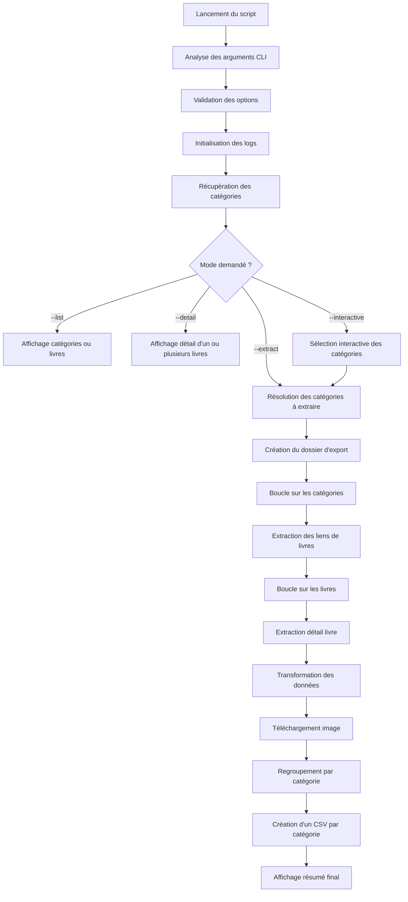

# Schéma de déroulement du programme — OC-PY02

**Projet :** OC-PY02 — Analyse de marché avec Python  
**Auteur :** Fabien Hummel  
**Objectif :** comprendre le déroulement du programme étape par étape.

---

## Vue globale du programme



---

## Déroulement détaillé

| Étape | Explication | Fonctions utilisées | Variables utilisées | Packages / modules utilisés | Techniques utilisées |
|---|---|---|---|---|---|
| **1. Lancement du programme** | Le script démarre depuis `src/main.py`. Si aucune option n'est fournie, l'aide est affichée. | `main()` | `sys.argv` | `sys` | Condition `if`, point d'entrée `if __name__ == "__main__"` |
| **2. Analyse des arguments** | Le programme lit les options saisies dans le terminal : `--extract`, `--categories`, `--detail`, `--quiet`, etc. | `parse_arguments()` | `parser`, `args` | `argparse` | Définition d'arguments CLI, options booléennes, `nargs`, `action="append"` |
| **3. Validation des arguments** | Le programme vérifie que les options sont cohérentes. Par exemple, `--quiet` n'est autorisé qu'avec `--extract`. | `validate_arguments(parser, args)` | `selected_modes`, `args.extract`, `args.quiet`, `args.categories` | `argparse` | Conditions `if`, liste de booléens, `parser.error()` |
| **4. Initialisation des logs** | Le programme crée un fichier log daté pour tracer l'exécution et les erreurs. | `setup_logger()` | `logger`, `log_file` | `logging`, `datetime`, `pathlib` | Configuration de logger, création de fichier, gestion de chemin |
| **5. Récupération des catégories** | Le programme charge la page d'accueil de Books to Scrape et extrait les catégories disponibles. | `extract_categories(HOME_URL)` | `HOME_URL`, `categories` | `requests`, `BeautifulSoup`, `urllib.parse` | Requête HTTP, parsing HTML, dictionnaire |
| **6. Choix du mode d'exécution** | Le programme détermine s'il doit lister des éléments, afficher un détail, lancer le mode interactif ou extraire les données. | `run_cli_mode()`, `run_interactive_mode()` | `args.list_mode`, `args.detail`, `args.extract`, `args.interactive` | `argparse`, `questionary` | Conditions `if`, séparation des modes |
| **7. Résolution des catégories** | Le programme transforme l'argument `--categories` en dictionnaire de catégories à traiter. | `resolve_categories()` | `categories`, `categories_argument`, `selected_categories`, `requested_name` | Python standard | Boucle `for`, `split(",")`, `strip()`, `casefold()`, dictionnaire |
| **8. Création du dossier d'export** | Le programme crée un dossier d'extraction daté dans `outputs/` ou dans le dossier fourni avec `--output`. | `build_export_dir()`, `get_default_export_dir()` | `output_dir`, `export_dir`, `timestamp`, `extraction_name` | `pathlib`, `datetime` | Création de dossier, `Path`, horodatage |
| **9. Boucle sur les catégories** | Le programme traite chaque catégorie sélectionnée une par une. | `extract_books()` | `category_name`, `category_url`, `books_by_category`, `summary` | `tqdm`, `pathlib` | Boucle `for`, dictionnaire, progression terminal |
| **10. Préparation du dossier catégorie** | Pour chaque catégorie, le programme prépare un dossier dédié contenant le CSV et les images. | `get_category_dir()`, `get_category_images_dir()` | `category_dir`, `images_dir`, `category_name` | `pathlib`, `python-slugify` | Slugification, organisation de fichiers |
| **11. Extraction des liens des livres** | Le programme parcourt les pages de la catégorie et récupère les URL des livres. | `extract_book_links_from_category()` | `book_links`, `category_name`, `category_url` | `requests`, `BeautifulSoup`, `urllib.parse`, `tqdm` | Pagination, boucle `for`, parsing HTML |
| **12. Boucle sur les livres** | Pour chaque livre trouvé, le programme récupère les détails et prépare les données. | `extract_books()` | `book`, `book_links`, `count`, `transformed_books` | `tqdm` | Boucle `for`, barre de progression, compteur |
| **13. Extraction du détail d'un livre** | Le programme ouvre la page produit et extrait les informations demandées. | `extract_book_details()`, `extract_product_information_table()`, `extract_product_description()`, `extract_product_rating()`, `extract_product_image_url()` | `details`, `soup`, `book`, `product_page_url` | `requests`, `BeautifulSoup`, `urllib.parse` | Parsing HTML, dictionnaire, gestion d'URL relative |
| **14. Transformation des données** | Les données brutes sont nettoyées et converties avant l'export CSV. | `transform_book()`, `clean_text()`, `extract_number_available()`, `convert_rating_to_number()` | `transformed_book`, `availability`, `review_rating`, `number_available` | `re` | Nettoyage texte, expression régulière, mapping, dictionnaire |
| **15. Construction du nom d'image** | Le programme crée un nom de fichier image lisible à partir de la catégorie, du titre et de l'UPC. | `build_image_file_name()` | `image_name`, `category`, `title`, `upc` | `python-slugify` | Slugification, concaténation de chaînes |
| **16. Téléchargement de l'image** | L'image du livre est téléchargée dans le dossier `images/` de sa catégorie. | `download_image()` | `image_url`, `image_path`, `image_summary` | `requests`, `pathlib` | Requête HTTP, écriture binaire, gestion d'erreur dans la boucle appelante |
| **17. Gestion des erreurs par livre** | Si un livre ou une image provoque une erreur, l'erreur est écrite dans les logs et le programme continue. | `extract_books()`, `logger.exception()` | `error`, `image_summary`, `book` | `logging` | Structure `try / except`, poursuite de la boucle |
| **18. Regroupement par catégorie** | Les livres transformés sont stockés dans un dictionnaire, classés par catégorie. | `extract_books()` | `books_by_category`, `transformed_books`, `summary` | Python standard | Dictionnaire de listes, compteur, affectation par clé |
| **19. Calcul du total extrait** | Le programme calcule le nombre total de livres extraits toutes catégories confondues. | `run_extraction()` | `total_books`, `books_by_category` | Python standard | Compréhension avec `sum()`, boucle implicite |
| **20. Sauvegarde des CSV par catégorie** | Le programme écrit un fichier CSV distinct pour chaque catégorie. | `save_category_csv_files()`, `get_category_csv_path()`, `save_books_to_csv()` | `csv_paths`, `csv_path`, `books`, `category_name` | `csv`, `pathlib`, `python-slugify` | Boucle `for`, écriture CSV, `csv.DictWriter` |
| **21. Création des dossiers parents** | Avant d'écrire un CSV ou une image, le programme s'assure que le dossier existe. | `save_books_to_csv()`, `download_image()` | `csv_path.parent`, `image_path.parent` | `pathlib` | `mkdir(parents=True, exist_ok=True)` |
| **22. Affichage du résumé** | Le programme affiche le nombre de livres extraits par catégorie, le nombre total, les CSV générés et le nombre d'images téléchargées. | `print_summary()`, `run_extraction()` | `summary`, `total_books`, `csv_paths`, `image_summary` | Python standard | Boucle `for`, affichage `print()`, formatage de chaînes |
| **23. Journalisation finale** | Le programme écrit dans le fichier log le dossier d'export, les CSV générés et les erreurs éventuelles. | `logger.info()`, `logger.warning()`, `logger.exception()` | `logger`, `export_dir`, `csv_paths`, `image_summary` | `logging` | Logs de niveaux différents, traçabilité |
| **24. Fin du programme** | Le programme termine son exécution. Les données sont prêtes à être utilisées ou zippées. | `run_extraction()`, `main()` | `export_dir`, `log_file` | Python standard | Retour de fonction, fin naturelle du script |

---

## Structure de sortie attendue

```text
outputs/
└── books_extraction_YYYYMMDD_HHMMSS/
    ├── classics/
    │   ├── classics.csv
    │   └── images/
    ├── philosophy/
    │   ├── philosophy.csv
    │   └── images/
    └── fantasy/
        ├── fantasy.csv
        └── images/
```

---

## Résumé pédagogique

Le programme suit une logique claire :

```text
Arguments CLI
    ↓
Catégories
    ↓
Livres
    ↓
Détails produits
    ↓
Transformation
    ↓
Images
    ↓
CSV par catégorie
    ↓
Dossier d'export final
```

Cette organisation montre bien la logique **ETL** :

| Étape ETL | Rôle |
|---|---|
| Extract | Récupérer les pages HTML, les catégories, les livres et les détails produits. |
| Transform | Nettoyer les textes, convertir les notes et extraire le stock disponible. |
| Load | Créer les dossiers, écrire les CSV par catégorie et sauvegarder les images. |
