# Protocole de tests — OC-PY02

**Projet :** OC-PY02 — Analyse de marché avec Python  
**Auteur :** Fabien Hummel  
**Objet :** Vérifier le bon fonctionnement du script avant livraison et soutenance.

---

## 1. Objectif du document

Ce protocole sert à vérifier que l'application fonctionne correctement depuis un environnement propre.

Il permet de contrôler :

- l'installation de l'environnement Python ;
- l'installation des dépendances ;
- les commandes principales du programme ;
- le mode interactif ;
- l'extraction des données ;
- la génération d'un CSV par catégorie ;
- le téléchargement des images dans le dossier de leur catégorie ;
- la création des logs ;
- la syntaxe de l'option `--detail`.

> 🔴 **Remarque :** les zones rouges ci-dessous indiquent les emplacements où coller les captures d'écran.  
> Si la couleur rouge n'est pas affichée dans GitHub, le texte reste identifiable grâce au symbole 🔴.

---

## 2. Préparation avant les tests

Les tests doivent être réalisés depuis la racine du projet :

```bash
cd ~/Python/OC-PY02
```

L'environnement virtuel doit être activé :

```bash
source .venv/bin/activate
```

### Vérification de l'état Git

```bash
git status
```

**Résultat attendu :**

- la branche doit être `main` ;
- le dépôt doit être à jour avec `origin/main` ;
- aucun fichier utile ne doit être en attente de commit avant le démarrage des tests.

<div style="color:red; font-weight:bold; border:1px dashed red; padding:10px;">
🔴 Résultat obtenu : capture d'écran du résultat de git status avant les tests.
</div>

<p align="center">
  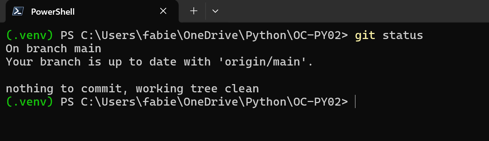
</p>

---

## 3. Test 01 — Affichage de l'aide

### Objectif

Vérifier que le programme affiche l'aide lorsqu'il est lancé sans option.

### Commande à lancer

```bash
python src/main.py
```

### Résultat attendu

Le terminal doit afficher l'aide du programme avec les options disponibles, notamment :

- `--interactive` ;
- `--extract` ;
- `--categories` ;
- `--output` ;
- `--list` ;
- `--detail` ;
- `--quiet`.

### Statut

- ✅ Réussi
- [ ] Échec

<div style="color:red; font-weight:bold; border:1px dashed red; padding:10px;">
🔴 Résultat obtenu : capture d'écran de l'aide affichée.
</div>

<p align="center">
  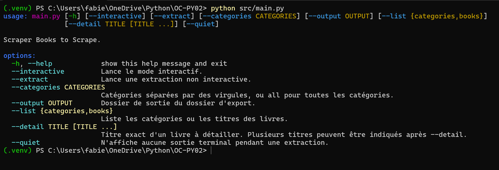
</p>
---

## 4. Test 02 — Liste des catégories

### Objectif

Vérifier que le programme récupère et affiche les catégories du site Books to Scrape.

### Commande à lancer

```bash
python src/main.py --list categories
```

### Résultat attendu

Le terminal doit afficher une liste de catégories, par exemple :

```text
Travel
Mystery
Historical Fiction
Sequential Art
Classics
Philosophy
```

La catégorie globale `Books` ne doit pas apparaître dans la liste.

### Statut

- ✅ Réussi
- [ ] Échec

<div style="color:red; font-weight:bold; border:1px dashed red; padding:10px;">
🔴 Résultat obtenu : capture d'écran de la liste des catégories.
</div>

<p align="center">
  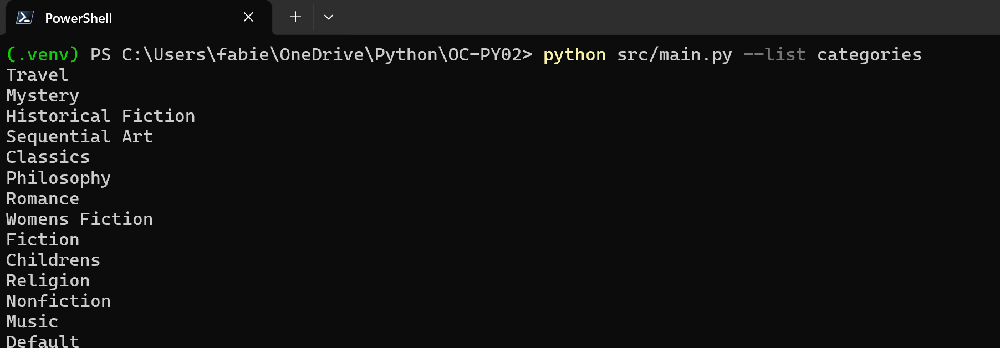
</p>
---

## 5. Test 03 — Liste des livres d'une catégorie

### Objectif

Vérifier que le programme affiche les titres des livres d'une catégorie précise.

### Commande à lancer

```bash
python src/main.py --list books --categories "Fantasy"
```

### Résultat attendu

Le terminal doit afficher uniquement les titres des livres de la catégorie `Fantasy`.

### Statut

- ✅ Réussi
- [ ] Échec

<div style="color:red; font-weight:bold; border:1px dashed red; padding:10px;">
🔴 Résultat obtenu : capture d'écran de la liste des livres de la catégorie Fantasy.
</div>

<p align="center">
  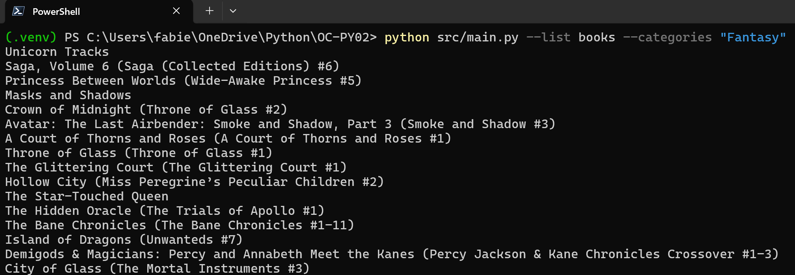
</p>
---

## 6. Test 04 — Détail d'un livre

### Objectif

Vérifier que le programme affiche les informations détaillées d'un livre précis.

### Commande à lancer

```bash
python src/main.py --detail "A Light in the Attic"
```

### Résultat attendu

Le terminal doit afficher les informations du livre, notamment :

- titre ;
- catégorie ;
- UPC ;
- prix TTC ;
- prix HT ;
- stock disponible ;
- note ;
- URL de l'image ;
- description.

### Statut

- ✅ Réussi
- [ ] Échec

<div style="color:red; font-weight:bold; border:1px dashed red; padding:10px;">
🔴 Résultat obtenu : capture d'écran du détail du livre A Light in the Attic.
</div>

<p align="center">
  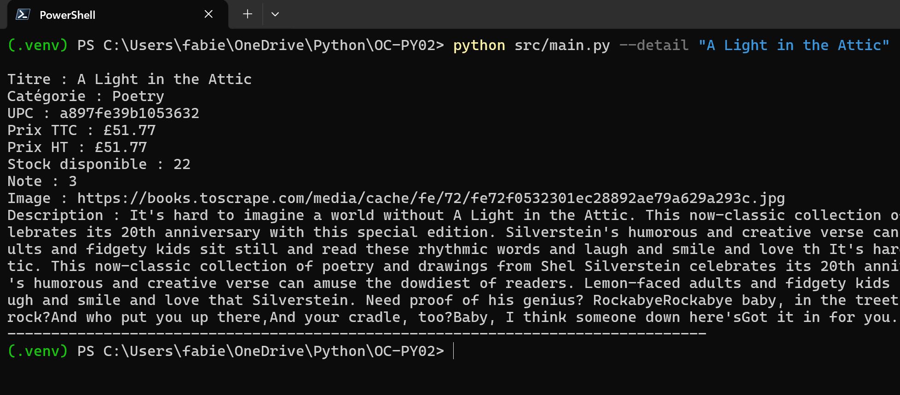
</p>
---

## 7. Test 05 — Détail de plusieurs livres avec la nouvelle syntaxe

### Objectif

Vérifier que `--detail` accepte plusieurs titres après une seule option.

### Commande à lancer

```bash
python src/main.py --detail "A Light in the Attic" "Soumission"
```

### Résultat attendu

Le terminal doit afficher successivement les détails des deux livres.

### Statut

- ✅ Réussi
- [ ] Échec

<div style="color:red; font-weight:bold; border:1px dashed red; padding:10px;">
🔴 Résultat obtenu : capture d'écran du détail des deux livres avec la nouvelle syntaxe --detail.
</div>

<p align="center">
  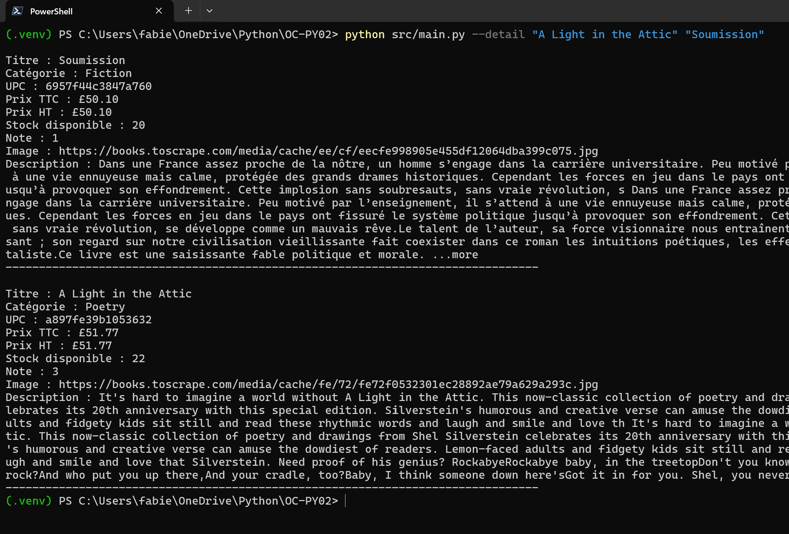
</p>
---

## 8. Test 06 — Compatibilité avec l'ancienne syntaxe de `--detail`

### Objectif

Vérifier que l'ancienne syntaxe reste fonctionnelle.

### Commande à lancer

```bash
python src/main.py --detail "The Requiem Red" --detail "Rip it Up and Start Again"
```

### Résultat attendu

Le terminal doit afficher les détails des deux livres.

### Statut

- ✅ Réussi
- [ ] Échec

<div style="color:red; font-weight:bold; border:1px dashed red; padding:10px;">
🔴 Résultat obtenu : capture d'écran du détail des deux livres avec l'ancienne syntaxe --detail répétée.
</div>

<p align="center">
  
</p>
---

## 9. Test 07 — Titre contenant une virgule

### Objectif

Vérifier que les titres contenant une virgule sont correctement traités lorsqu'ils sont placés entre guillemets.

### Commande à lancer

```bash
python src/main.py --detail "In a Dark, Dark Wood"
```

### Résultat attendu

Le programme doit rechercher le titre complet, sans découper le titre au niveau de la virgule.

### Statut

- ✅ Réussi
- [ ] Échec

<div style="color:red; font-weight:bold; border:1px dashed red; padding:10px;">
🔴 Résultat obtenu : capture d'écran du test avec un titre contenant une virgule.
</div>

<p align="center">
  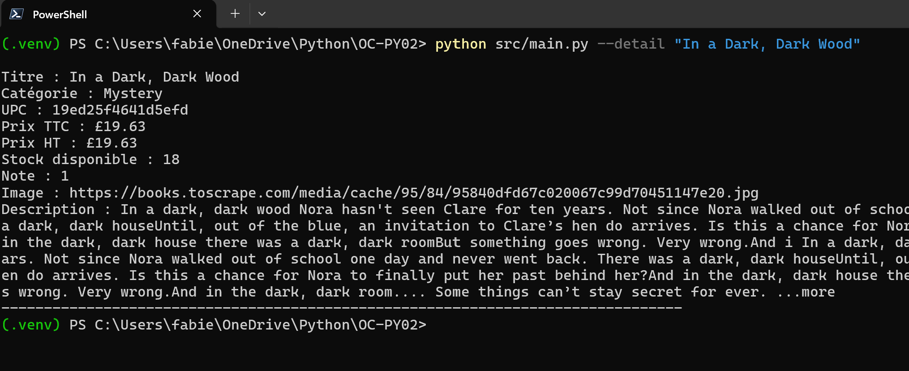
</p>
---

## 10. Test 08 — Catégorie inexistante

### Objectif

Vérifier le comportement du programme lorsqu'une catégorie incorrecte est fournie.

### Commande à lancer

```bash
python src/main.py --list books --categories "CategorieInexistante"
```

### Résultat attendu

Le terminal doit afficher un message indiquant que la catégorie est inconnue ou qu'aucune catégorie n'est sélectionnée.

Le programme ne doit pas se fermer avec une erreur Python non maîtrisée.

### Statut

- ✅ Réussi
- [ ] Échec

<div style="color:red; font-weight:bold; border:1px dashed red; padding:10px;">
🔴 Résultat obtenu : capture d'écran du test avec une catégorie inexistante.
</div>

<p align="center">
  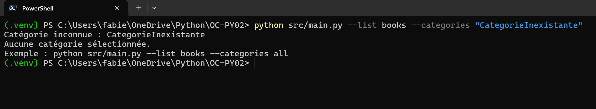
</p>
---

## 11. Test 09 — Extraction d'une catégorie

### Objectif

Vérifier qu'une extraction complète fonctionne sur une catégorie limitée.

### Commande à lancer

```bash
python src/main.py --extract --categories "Fantasy"
```

### Résultat attendu

Le programme doit :

- afficher la progression de l'extraction ;
- créer un dossier d'extraction daté dans `outputs/` ;
- créer un sous-dossier `fantasy/` ;
- générer `fantasy/fantasy.csv` ;
- générer `fantasy/images/` ;
- générer un fichier log dans `logs/` ;
- afficher un résumé final.

### Statut

- ✅ Réussi
- [ ] Échec

<div style="color:red; font-weight:bold; border:1px dashed red; padding:10px;">
🔴 Résultat obtenu : capture d'écran de l'extraction de la catégorie Fantasy et du résumé final.
</div>

<p align="center">
  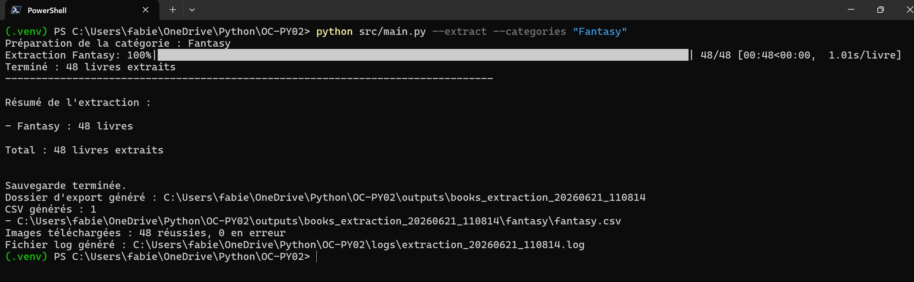
</p>
---

## 12. Test 10 — Extraction de plusieurs catégories

### Objectif

Vérifier que plusieurs catégories peuvent être extraites dans une seule exécution et que chaque catégorie dispose de son propre CSV.

### Commande à lancer

```bash
python src/main.py --extract --categories "Classics,Philosophy"
```

### Résultat attendu

Le programme doit générer une structure similaire à :

```text
outputs/books_extraction_YYYYMMDD_HHMMSS/
├── classics/
│   ├── classics.csv
│   └── images/
└── philosophy/
    ├── philosophy.csv
    └── images/
```

Le résumé final doit afficher le nombre de livres extraits par catégorie et le total.

### Statut

- ✅ Réussi
- [ ] Échec

<div style="color:red; font-weight:bold; border:1px dashed red; padding:10px;">
🔴 Résultat obtenu: capture d'écran de l'extraction des catégories Classics et Philosophy.
</div>

<p align="center">
  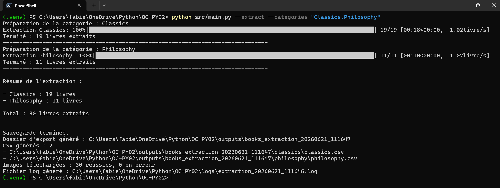
</p>
---

## 13. Test 11 — Utilisation d'un dossier de sortie personnalisé

### Objectif

Vérifier que l'option `--output` permet de choisir le dossier contenant le dossier d'extraction.

### Commande à lancer

```bash
python src/main.py --extract --categories "Fantasy" --output "./exports_test"
```

### Résultat attendu

Le programme doit générer :

```text
exports_test/books_extraction_YYYYMMDD_HHMMSS/
└── fantasy/
    ├── fantasy.csv
    └── images/
```

Le fichier log doit rester dans le dossier `logs/`.

### Statut

- ✅ Réussi
- [ ] Échec

<div style="color:red; font-weight:bold; border:1px dashed red; padding:10px;">
🔴 Résultat obtenu : capture d'écran du dossier exports_test et du résumé d'extraction.
</div>

<p align="center">
  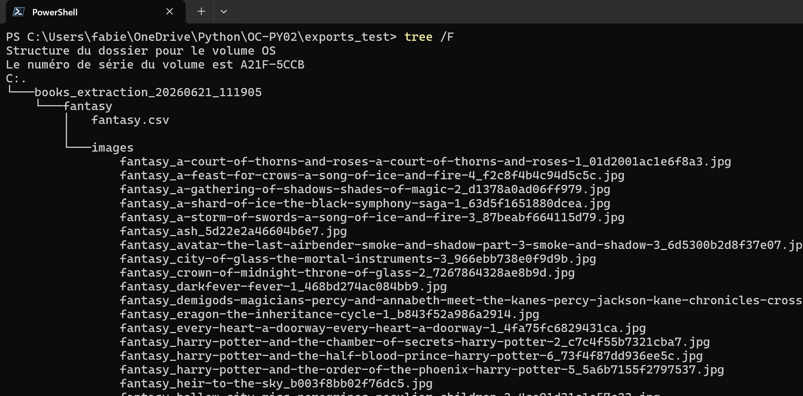
</p>
---

## 14. Test 12 — Mode silencieux

### Objectif

Vérifier que le mode `--quiet` limite les sorties terminal tout en générant les fichiers attendus.

### Commande à lancer

```bash
python src/main.py --extract --categories "Mystery" --quiet
```

### Résultat attendu

Le terminal doit rester silencieux ou presque silencieux.

Les fichiers doivent tout de même être générés :

- dossier d'extraction ;
- CSV de la catégorie ;
- images de la catégorie ;
- log.

### Statut

- ✅ Réussi
- [ ] Échec

<div style="color:red; font-weight:bold; border:1px dashed red; padding:10px;">
🔴 Résultat obtenu : capture d'écran du terminal après exécution en mode quiet et des fichiers générés.
</div>

<p align="center">
  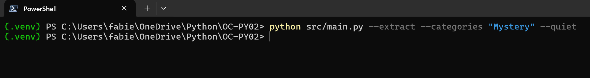
  <br>
  <em>Exécution en mode quiet</em>
  <br><br>

  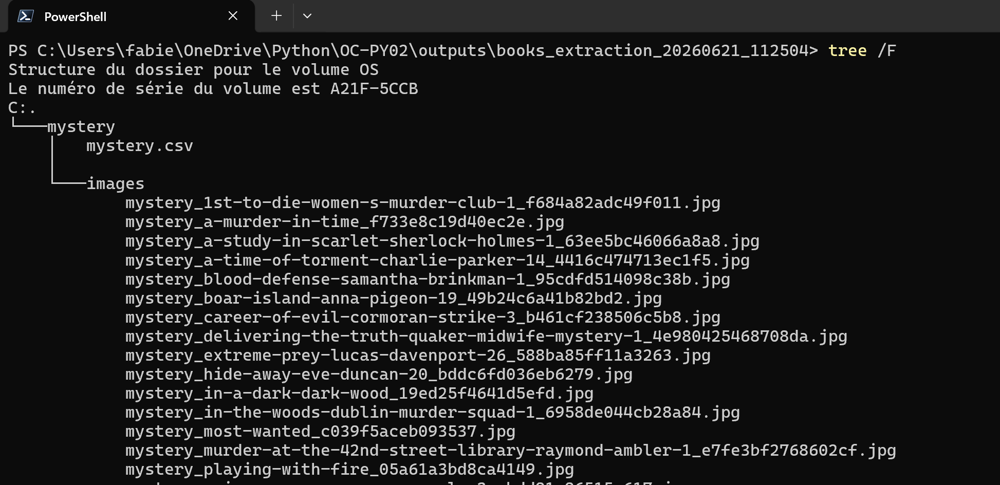
  <br>
  <em>Fichiers générés après extraction</em>
</p>
---

## 15. Test 13 — Vérification des fichiers CSV

### Objectif

Vérifier que les CSV générés contiennent les colonnes attendues.

### Commande à lancer en Bash/Linux

```bash
python - <<'PY'
import csv
from pathlib import Path

csv_files = sorted(Path('outputs').glob('books_extraction_*/**/*.csv'))

for csv_path in csv_files[-3:]:
    with csv_path.open(encoding='utf-8-sig', newline='') as csv_file:
        reader = csv.DictReader(csv_file)
        print(csv_path)
        print(reader.fieldnames)
        print()
PY
```
### Commande à lancer en Powershell
```powershell
@'
import csv
from pathlib import Path

csv_files = sorted(Path("outputs").glob("books_extraction_*/**/*.csv"))

for csv_path in csv_files[-3:]:
    with csv_path.open(encoding="utf-8-sig", newline="") as csv_file:
        reader = csv.DictReader(csv_file)
        print(csv_path)
        print(reader.fieldnames)
        print()
'@ | python
```

### Résultat attendu

Chaque CSV doit afficher les colonnes suivantes :

```text
product_page_url
universal_product_code
title
price_including_tax
price_excluding_tax
number_available
product_description
category
review_rating
image_url
```

### Statut

- ✅ Réussi
- [ ] Échec

<div style="color:red; font-weight:bold; border:1px dashed red; padding:10px;">
🔴 Résultat obtenu : capture d'écran des colonnes affichées depuis les CSV générés.
</div>

<p align="center">
  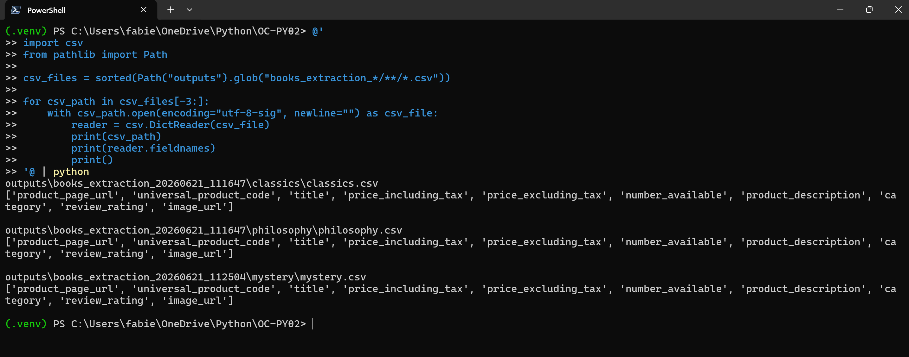
</p>
---

## 16. Test 14 — Vérification des images

### Objectif

Vérifier que les images sont bien téléchargées dans les dossiers de catégories.

### Commande à lancer

```bash
find outputs -path "*/images/*" -type f | head
```

```powershell
Get-ChildItem -Path outputs -Recurse -File |
    Where-Object { $_.FullName -like "*\images\*" } |
    Select-Object -First 10 |
    ForEach-Object { $_.FullName }
```

### Résultat attendu

Le terminal doit afficher plusieurs fichiers images situés dans des dossiers de ce type :

```text
outputs/books_extraction_YYYYMMDD_HHMMSS/fantasy/images/
```

Les noms doivent être lisibles et contenir des éléments comme la catégorie, le titre du livre et l'UPC.

### Statut

- ✅ Réussi
- [ ] Échec

<div style="color:red; font-weight:bold; border:1px dashed red; padding:10px;">
🔴 Résultat obtenu : capture d'écran de la liste des images téléchargées.
</div>

<p align="center">
  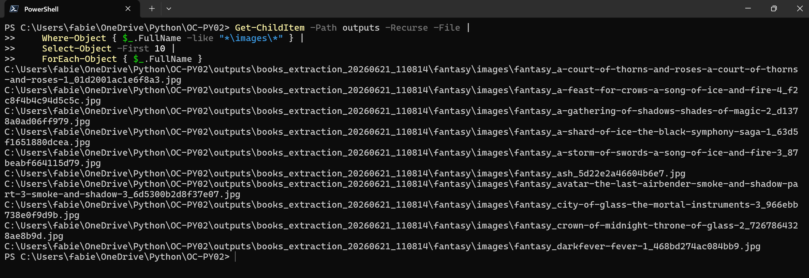
</p>
---

## 17. Test 15 — Vérification des logs

### Objectif

Vérifier que le fichier log est bien généré.

### Commande à lancer

```bash
ls -lt logs | head
```
```powershell
Get-ChildItem -Path logs |
    Sort-Object LastWriteTime -Descending |
    Select-Object -First 10 Name, LastWriteTime, Length
```

### Résultat attendu

Le terminal doit afficher au moins un fichier de log nommé selon ce format :

```text
extraction_YYYYMMDD_HHMMSS.log
```

### Statut

- ✅ Réussi
- [ ] Échec

<div style="color:red; font-weight:bold; border:1px dashed red; padding:10px;">
🔴 Résultat obtenu: capture d'écran de la liste des fichiers logs.
</div>

<p align="center">
  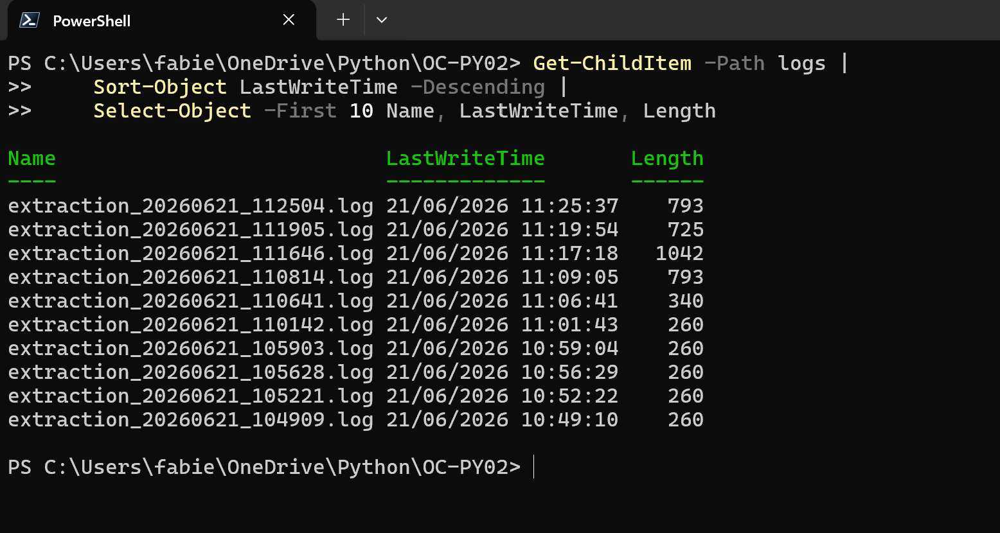
</p>
---

## 18. Test 16 — Vérification que les fichiers générés ne sont pas versionnés

### Objectif

Vérifier que les fichiers générés ne sont pas ajoutés au dépôt Git.

### Commande à lancer

```bash
git status
```

### Résultat attendu

Les fichiers générés dans `outputs/`, `logs/` ou `exports_test/` ne doivent pas être proposés comme fichiers à committer.

Si certains fichiers apparaissent, il faut vérifier le fichier `.gitignore`.

### Statut

- ✅ Réussi
- [ ] Échec

<div style="color:red; font-weight:bold; border:1px dashed red; padding:10px;">
🔴 Résultat obtenu: capture d'écran du git status après génération des fichiers.
</div>

<p align="center">
  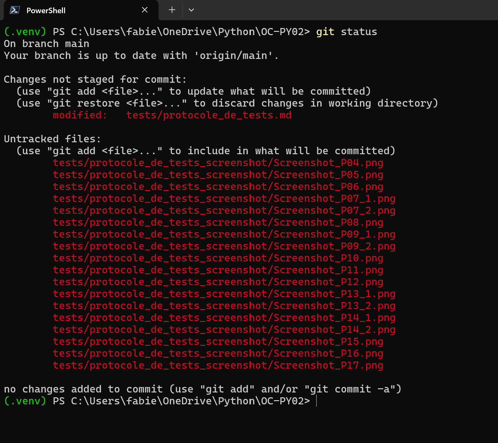
</p>
---

## 19. Nettoyage après les tests

### Objectif

Supprimer les fichiers générés uniquement pour les tests si nécessaire.

### Commande possible

```bash
rm -rf exports_test
```

Les dossiers `outputs/` et `logs/` peuvent être conservés localement le temps de préparer le ZIP demandé dans les livrables.

---

## 20. Validation finale

| Point de contrôle | Statut |
|---|---|
| L'aide s'affiche correctement | ✅ OK |
| Les catégories sont listées | ✅ OK |
| Les livres d'une catégorie sont listés | ✅ OK |
| Le détail d'un livre fonctionne | ✅ OK |
| Le détail de plusieurs livres fonctionne | ✅ OK |
| L'extraction d'une catégorie fonctionne | ✅ OK |
| L'extraction de plusieurs catégories fonctionne | ✅ OK |
| Un CSV est généré par catégorie | ✅ OK |
| Les images sont téléchargées dans le dossier de leur catégorie | ✅ OK |
| Les logs sont générés | ✅ OK |
| Les fichiers générés ne sont pas versionnés | ✅ OK |

---

## 21. Conclusion du protocole

Lorsque tous les tests sont validés, le projet peut être considéré comme prêt pour :

- la démonstration de soutenance ;
- la génération du fichier ZIP des données ;
- la remise du lien GitHub ;
- la remise du mail PDF décrivant le pipeline ETL.
